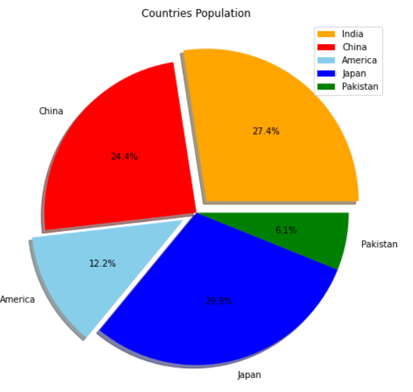

# Python Matplotlib Tutorial

## Table of Contents

1. What is Data Visualization?
2. Why Data Visualization?
3. What is Matplotlib?
4. Types of Plots

## What is Data Visualization?
Data visualization is the presentation of data in a pictorial or graphical form. 


## Why Data Visualization?
* To present data in more understandable form. 
* It allows us to quickly interpret the data and adjust different variables to see their effect.


## What is Matplotlib?
Matplotlib is a comprehensive library for creating static, animated, and interactive visualizations in Python.


## Types of Plots
### 1. Line Plot
A line graph is commonly used to display change over time. The line graph therefore helps to determine the relationship between two sets of values, with one data set always being dependent on the other set.
**Example:**
```python
# Importing Libraries
import matplotlib.pyplot as plt
import numpy as np

# Data for plotiing Line Plot
x = np.arange(1,51)
y = 2*x

# Plotting Line Plot
plt.plot(x,y, color='green', linewidth=5, linestyle=":", marker='o')
plt.title("Line Plot")
plt.xlabel("X-axis")
plt.ylabel("Y-axis")
plt.show()

# Plotting Multiple line plots
x1 = np.arange(1,11)
y1 = 2*x1 + 5
y2 = 3*x1 + 4

plt.plot(x1,y1, color='green',linestyle='dashed',linewidth=2, marker='o')
plt.plot(x1,y2,color='red', linewidth=2, marker='*')
plt.grid(True, color='black')
plt.show()
```
***

### 2. Scatter Plots
A scatter plot is a chart type that is normally used to observe and visually display the relationship between variables.
**Example:**
```python
x = np.arange(1,11)
y1 = x**4
y2 = x**3 + 7

plt.style.use('seaborn')
plt.figure(figsize = (6,6))
plt.scatter(x,y1, color='red', label='Plot 1')
plt.scatter(x,y2, color='yellow', label='Plot 2')
plt.legend()
plt.show()
```
***

### 3. Bar Plots
* Bar plots are used to see distribution of categorical data.
* Bar plots are used to compare things between different groups or to track changes over time. 

**Example:**
```python
# Simple Bar plot

students = {"Rahul":40, "Neha":70, "Shubham":90}
names = list(students.keys())
marks = list(students.values())
plt.bar(names,marks, color='skyblue')
plt.xlabel('Student Names')
plt.ylabel('Marks')
plt.show()

# Comparison Bar plots
plt.style.use('seaborn')
x_coord = np.array([1, 2, 3, 4])

x1 = x_coord - 0.125
x2 = x_coord + 0.125
y1 = np.array([10,15,20,25])
y2 = np.array([15,10,18,26])
xlabels = ['Gold','Silver','Bronze','Platinum']

plt.bar(x1, y1, width = 0.25, tick_label = xlabels, color = 'yellow',label = 2019)
plt.bar(x2,y2,width = 0.25,color = 'blue',label = 2020)
plt.xlabel('Metals')
plt.ylabel('Price')
plt.title('Metal Prices')
plt.legend(fontsize = 15)
plt.show()
```
***

### 4. Pie Chart
* Pie charts is used to have a general sense of the part-to-whole relationship in your data.
* To convey that one segment of the total is relatively less or more important.
**Example:**
```python
# Simple pie plot
data = np.array([35,25,25,15])
plt.pie(data)
plt.show()

population = np.array([90,80,40,98,20])
countries = ["India","China","America","Japan","Pakistan"]
mycolors = ["orange","red","skyblue","blue","green"]
spacing = (0.1,0,0.1,0,0)

plt.figure(figsize = (8,8))
plt.pie(population, labels=countries, explode=spacing, shadow = True, colors=mycolors, autopct= '%1.1f%%')
plt.title('Countries Population')
plt.legend()
plt.show()
```


***
###
